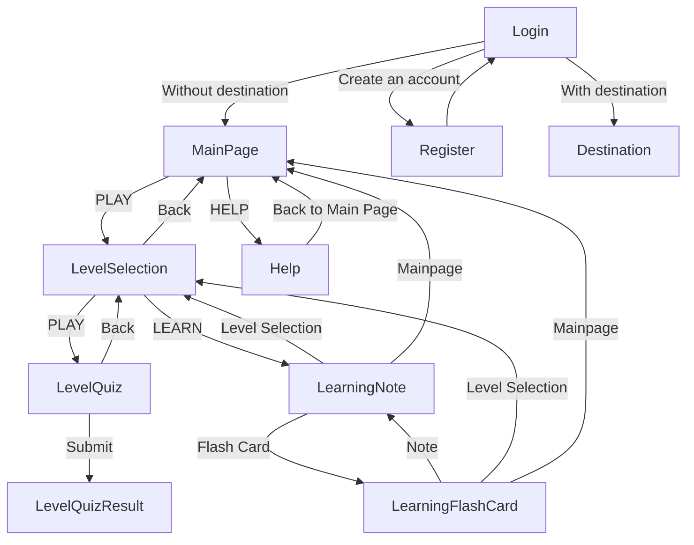

This is just a sample quiz.

# Important Notes:

* Please first start with `./SetupLocalhostPython.bat`, it will setup a localhost. Then there should be a URL (likely http://127.0.0.1:5000) on the opened command prompt, can access the page from there.
* Discouraged to access the pages via HTML files in `FE/Pages`.
* Please ensure `MySQL80` service is running.
* Please ensure there is a correct database in MySQL. Can refer to the *MySQL* in [requirements](#requirements).

## Requirements

1. **Python**
  * Packages required can refer to `requirements.txt` (not updated yet)
  * Install package using this command in command prompt: `pip install -r requirements.txt`
2. **MySQL**
  * Create table using SQL script `DB/DB_draft2.sql` (**will replace database with the same name, all previous data will be removed**).
3. **.env**
  * Keys:
    1. `MySQL_DB_HOST`: Hose used for `mysql.connector.connect`. Defaults to `localhost`.
    2. `MySQL_DB_Name`: The name of the database. Defaults to `SampleQuiz_RoadSafety`, which is the same as in `DB/DB_draft2.sql`.
    3. `MySQL_User`: MySQL user. Deaults to `root`.
    4. `MySQL_PW`: The password of the user. Defaults to empty string.
    5. `JWT_secret_key`: The secret key for *JWT*. Defaults to empty string, which isn't recommended.
    6. `JWT_algorithm`: The algorithm for *JWT*. Defaults to empty string, which I don't know what will happen.
  * Highly suggested to set the values for `MySQL_PW` (assuming the user has password, which it likely has), `JWT_secret_key`, `JWT_algorithm`.
  * The MySQL user should at least have permission to `SELECT`, `INSERT`, and `DELETE`.
  * The *.env* file should be placed inside the *SampleQuiz* folder, same folder as `App.py`.

# Flow



# Quiz & Flashcard Content Design

## Overview
This document analyzes how quiz content and flashcard content should be related, including question structure, explanations, and shared content management.

### Assumptions
* Each flashcard has two sides:
  * **Front**: The question or prompt
  * **Back**: The answer or explanation
* In quizzes:
  * Users select an answer from multiple choices.
  * After answering, a popup shows the explanation.
* Users may optionally review flashcards before attempting quizzes.

---

## Key Questions & Considerations

### 1️⃣ Should quizzes and flashcards share the same question bank?

**Pros**
1. Simplifies content management — only one source of truth.
2. Ensures learning consistency — quiz questions reinforce flashcard content.

**Cons**
1. Some content might not translate well between formats (e.g., multiple-choice distractors may not make sense for flashcards).

---

### 2️⃣ If yes to #1 — can the same explanation be used as both:
* The flashcard back (answer), and
* The quiz explanation?

**Pros**
1. Less duplication of content — easier maintenance.

**Cons**
1. Writing may become awkward:
   * Flashcards assume no provided answer choices.
   * Quiz explanations may reference choices that don’t exist in flashcards.

---

### 3️⃣ Should the quiz include an explanation for **each** answer choice (correct or incorrect)?

**Pros**
1. Stronger learning — users understand **why** answers are right or wrong.

**Cons**
1. Increases writing workload.

---

### 4️⃣ If yes to #3 — should there also be a **generic explanation** for the question itself?
(Used for flashcards and before answer-specific explanations in quizzes)

**Pros**
1. Better learning structure:
   * Flashcards show a complete answer.
   * Quizzes provide additional reasoning tied to each choice.
2. Writing becomes easier — generic explanation doesn’t depend on multiple-choice format.

**Cons**
1. Adds more content to create and manage.

---

### 5️⃣ If yes to #1 — should flashcard fronts display the quiz’s multiple-choice options (but non-interactive)?

**Pros**
1. Explanations remain consistent between quiz and flashcard formats.

**Cons**
1. Flashcards become too similar to quizzes — reduced distinction in learning experience.

---

## Current Takes:

1. Quizzes and flashcards share the same question bank.
2. Quizzes and flashcards share the same explanation.
3. No answer-specific-explanation for quizzes.
4. The only explanation that used for both quizzes and flashcards is generic.
5. Flashcards will only display the question.

---

# Scores

Can get all the scores of a user via:

1. [database](#get-scores-via-database)
2. [API](#get-scores-via-api)

## Get Scores via Database

Go to MySQL and run SQL script below:

```MySQL
USE SampleQuiz_RoadSafety;

SELECT * FROM Scores;
```

## Get Scores via API

1. Authentication token is required for this API. Login is required to get the token. To login:

* Change URL to `{host}/Login.html` to navigate to login page manually. The token will be stored in the *session storage* as `JWT`. Please note that, for unknown reason, the token in *session storage* will be surrounded by `"`, which is needed to be discarded before passing to the *header*.
* Complete a quiz, then user will be request to login, which will then bring user to login page. The token will be stored in *session storage*, like step above.
* Using API `{host}/API/Login` using `POST` method with `username` and `password` in the *body*. If login success, `token` in the returned JSON is the token.

1. By using `GET` method on API `{host}/API/Scores`, with previously get JWT in *header* `Authorization`, the API will return a JSON array of scores of the user containing:

* `ID` (`INT`)
* `LevelID` (`INT`)
* `QuizMark` (mark scored by user, `INT`. `QuizMark / TotalQuizMark` is the percentage)
* `TotalQuizMark` (total full mark of the quiz, `INT`)
* `StartDatetime` (`BIGINT`)
* `CompletionDatetime` (nullable, `BIGINT`)
* `QuizInfo` (JSON string)

---

**host**: This is the host the flask running on. Likely `http://127.0.0.1:5000` or the device IP with port `5000`.