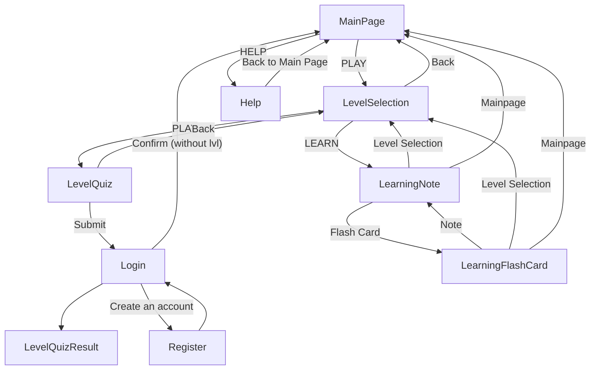

This is just a sample quiz.

Please first start with `./SetupLocalhostPython.bat`, it will setup a localhost.

Python required.

# Flow

# Quiz & Flashcard Content Design

## Overview
This document analyzes how quiz content and flashcard content should be related, including question structure, explanations, and shared content management.

### Assumptions
* Each flashcard has two sides:
  * **Front**: The question or prompt
  * **Back**: The answer or explanation
* In quizzes:
  * Users select an answer from multiple choices.
  * After answering, a popup shows the explanation.
* Users may optionally review flashcards before attempting quizzes.

---

## Key Questions & Considerations

### 1️⃣ Should quizzes and flashcards share the same question bank?

**Pros**
1. Simplifies content management — only one source of truth.
2. Ensures learning consistency — quiz questions reinforce flashcard content.

**Cons**
1. Some content might not translate well between formats (e.g., multiple-choice distractors may not make sense for flashcards).

---

### 2️⃣ If yes to #1 — can the same explanation be used as both:
* The flashcard back (answer), and
* The quiz explanation?

**Pros**
1. Less duplication of content — easier maintenance.

**Cons**
1. Writing may become awkward:
   * Flashcards assume no provided answer choices.
   * Quiz explanations may reference choices that don’t exist in flashcards.

---

### 3️⃣ Should the quiz include an explanation for **each** answer choice (correct or incorrect)?

**Pros**
1. Stronger learning — users understand **why** answers are right or wrong.

**Cons**
1. Increases writing workload.

---

### 4️⃣ If yes to #3 — should there also be a **generic explanation** for the question itself?
(Used for flashcards and before answer-specific explanations in quizzes)

**Pros**
1. Better learning structure:
   * Flashcards show a complete answer.
   * Quizzes provide additional reasoning tied to each choice.
2. Writing becomes easier — generic explanation doesn’t depend on multiple-choice format.

**Cons**
1. Adds more content to create and manage.

---

### 5️⃣ If yes to #1 — should flashcard fronts display the quiz’s multiple-choice options (but non-interactive)?

**Pros**
1. Explanations remain consistent between quiz and flashcard formats.

**Cons**
1. Flashcards become too similar to quizzes — reduced distinction in learning experience.

---
